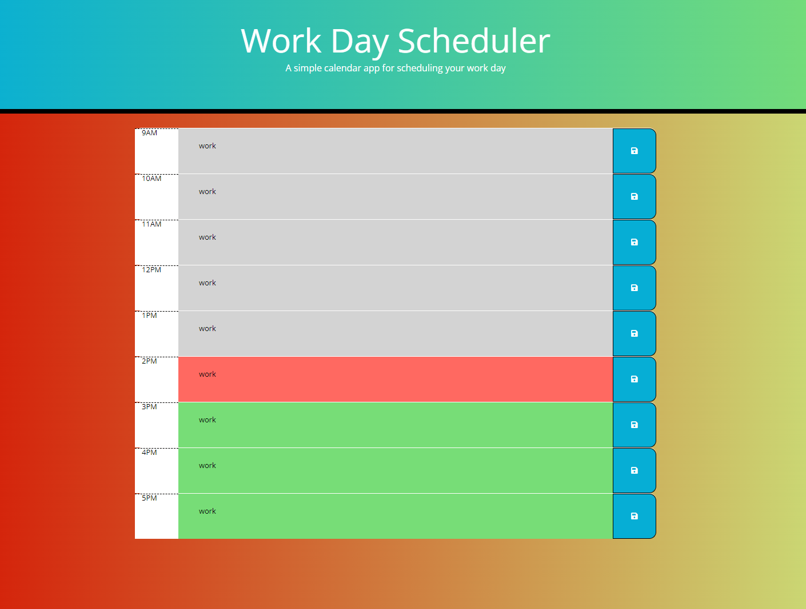

# Work Day Scheduler 📅

Welcome! ☺️👋

## Description 📝

This is a work day scheduler for the user to schedule important events for their 9AM to 5PM work day. This was created so that a user can organize their work day with the ability to save the schedule they have created. The schedule will allow the user to manage their time effectively.

## Deployed Webpage 🖥️

https://gbundakji.github.io/work-day-schedular/

## Visuals 📷

Work Day Scheduler Webpage:

## Credits 🌎

https://momentjs.com/

https://developer.mozilla.org/en-US/docs/Web/API/Document_Object_Model/Traversing_an_HTML_table_with_JavaScript_and_DOM_Interfaces

https://developer.mozilla.org/en-US/docs/Web/API/Element/blur_event

https://www.w3schools.com/jquery/event_load.asp#:~:text=load()%20.,)%2C%20and%20the%20window%20object.

https://developer.mozilla.org/en-US/docs/Web/API/Storage/getItem

https://developer.mozilla.org/en-US/docs/Web/API/Storage/setItem

https://developer.mozilla.org/en-US/docs/Web/API/Window/localStorage

https://developer.mozilla.org/en-US/docs/Web/JavaScript/Reference/Operators/this

https://www.w3schools.com/js/js_this.asp

https://www.w3schools.com/jquery/html_html.asp

## License 🔑

MIT License

Copyright (c) [2022] [Gassan-Bundakji]

Permission is hereby granted, free of charge, to any person obtaining a copy of this software and associated documentation files (the "Software"), to deal in the Software without restriction, including without limitation the rights to use, copy, modify, merge, publish, distribute, sublicense, and/or sell copies of the Software, and to permit persons to whom the Software is furnished to do so, subject to the following conditions:

The above copyright notice and this permission notice shall be included in all copies or substantial portions of the Software.

THE SOFTWARE IS PROVIDED "AS IS", WITHOUT WARRANTY OF ANY KIND, EXPRESS OR IMPLIED, INCLUDING BUT NOT LIMITED TO THE WARRANTIES OF MERCHANTABILITY, FITNESS FOR A PARTICULAR PURPOSE AND NONINFRINGEMENT. IN NO EVENT SHALL THE AUTHORS OR COPYRIGHT HOLDERS BE LIABLE FOR ANY CLAIM, DAMAGES OR OTHER LIABILITY, WHETHER IN AN ACTION OF CONTRACT, TORT OR OTHERWISE, ARISING FROM, OUT OF OR IN CONNECTION WITH THE SOFTWARE OR THE USE OR OTHER DEALINGS IN THE SOFTWARE.

